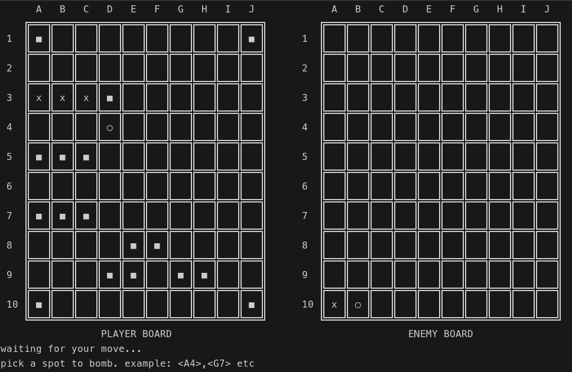

# cpp-warships



CPP Terminal Warships is an extended version of the console-based Battleship game implemented in C++. This iteration not only maintains the strategic grid-based gameplay but also introduces LAN multiplayer functionality with networking implemented in C++.

Players can now engage in a battle of wits over a Local Area Network (LAN). The game utilizes basic socket programming concepts for networking, allowing two players on separate terminals to connect and play against each other.

The ship placement, attack mechanics, and game state management remain consistent with the original version. However, the addition of networking functionality enables players to experience the thrill of naval warfare against human opponents on the same network.

The game interface displays the player's own grid, hits, and misses, as well as the opponent's grid during multiplayer matches. Players take turns inputting coordinates for attacks, and the terminal updates dynamically to reflect the outcomes, facilitating real-time gameplay over the LAN.

This version of CPP Terminal Warships not only serves as a C++ programming exercise but also introduces basic networking concepts, making it an educational tool for those interested in learning about socket programming and multiplayer game implementation in a console environment.

## installation

```bash
git clone git@github.com:wojlin/cpp-warships.git
cd cpp-warships
git submodule add -f https://github.com/google/googletest.git external/googletest
```

### 1. via cmake

```bash
mkdir build
cd build
cmake ..
cmake --build .
```

### 2. via g++

```bash
g++ src/main.cpp src/gameplay.cpp src/connection.cpp -o warships
```

## running

### by default

```bash
./warships
```

### in quick mode

#### host
```bash

./warships --mode host --address 8080 --autoplace false
```
#### join
```bash

./warships --mode join --address 172.0.0.1:8080 --autoplace false

```